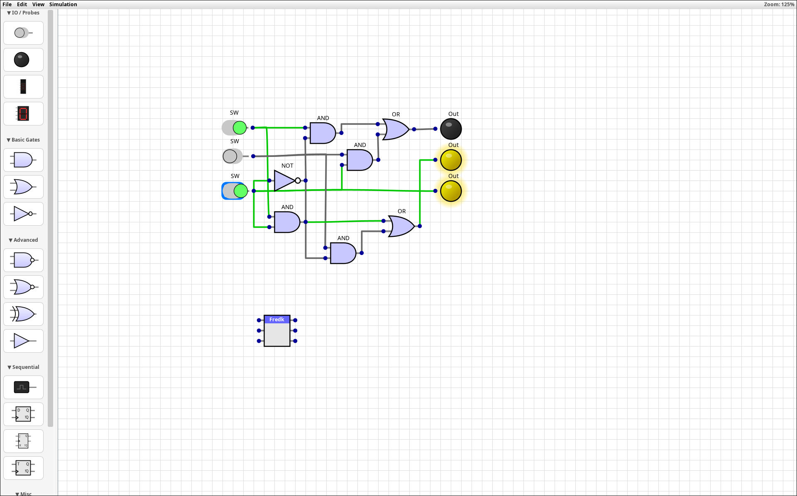

<div align="center">

  

  <h1 style="border-bottom: none;">Logik Simulator</h1>

  <p>
    <strong>A professional-grade, cross-platform digital logic circuit simulator.</strong>
    <br>
    Design, simulate, and package custom Integrated Circuits with ease.
  </p>

  <a href="LICENSE">
    
  </a>
  
  
  

</div>

<br />

<div align="center">
  
</div>

---

## ⚡ Features

Logik is a robust simulation environment designed for students, hobbyists, and engineers.

* **Comprehensive Component Library:**
    * **Basic Logic:** AND, OR, NOT, XOR, NAND, NOR, Buffer.
    * **Sequential Logic:** D Flip-Flop, T Flip-Flop, JK Flip-Flop, Clock generators.
    * **I/O Peripherals:** Switches, Output Probes (LEDs), 7-Segment Displays, Hex Displays.
    * **Annotation:** Text labels to document your circuit designs.
* **Advanced Simulation Engine:** Real-time, event-driven simulation with adjustable clock speeds (0.5Hz to 50Hz) and variable logic propagation speeds.
* **Custom Integrated Circuits (ICs):** Package complex circuits into reusable "Black Box" chips to build high-level architectures.
* **Modern User Experience:** Smooth panning, zooming, snap-to-grid placement, and multi-selection support.
* **Theming System:** Customisable themes including **Dracula**, **Nord**, **Solarized**, and **Monokai**, with deep UI styling for menus and scrollbars.
* **State Persistence:** Automatically saves your window state, layout preferences, and last-used theme between sessions.
* **Cross-Platform:** Runs seamlessly on Windows, macOS, and Linux.

## 🚀 Installation & Running

### Option 1: Windows Installer (Recommended for Windows)
Download the `.exe` installer from the [Releases Page](#). This creates a standard desktop application.

### Option 2: Universal JAR (Cross-Platform)
For macOS, Linux, or Windows users who prefer the portable version:

1.  Ensure you have **Java 17** or higher installed.
2.  Download `Logik.jar` from the [Releases Page](#).
3.  Double-click the file to launch, or run via terminal:
    ```bash
    java -jar Logik.jar
    ```

### Option 3: Build from Source
If you wish to modify the code or compile it yourself:

```bash
# Clone the repository
git clone https://github.com/JamieLittle16/logik.git

# Build the Runnable JAR (Windows)
gradlew shadowJar

# Build the Runnable JAR (Mac/Linux)
./gradlew shadowJar

```

The output file will be located in `build/libs/`.

## 🎮 Controls & Hotkeys

Logik is designed for speed and efficiency using industry-standard shortcuts.

### Navigation & View

| Action | Mouse | Keyboard |
| --- | --- | --- |
| **Pan View** | Middle Click Drag | `Alt` + Left Click Drag |
| **Zoom In/Out** | Mouse Wheel | `Ctrl` + `+` / `-` |
| **Reset Zoom** |  | `Ctrl` + `0` |
| **Fullscreen** |  | `F11` |

### Editing

| Action | Mouse | Keyboard |
| --- | --- | --- |
| **Select** | Left Click / Drag Box |  |
| **Multi-Select** | `Shift` + Left Click |  |
| **Place Component** | Left Click (from Palette) |  |
| **Rotate (90)** |  | `R` (while placing or selecting) |
| **Rotate(18)** | | `Ctrl` + `R` |
| **Delete** |  | `Delete` or `Backspace` |
| **Undo** |  | `Ctrl` + `Z` |
| **Redo** |  | `Ctrl` + `Y` |
| **Cut** |  | `Ctrl` + `X` |
| **Copy** |  | `Ctrl` + `C` |
| **Paste** |  | `Ctrl` + `V` |
| **Rename / Edit Text** | Double Left Click |  |
| **Context Menu** | Right Click |  |

### Simulation

| Action | Input |
| --- | --- |
| **Toggle Switch** | Left Click on Switch |
| **Manual Step (Tick)** | `T` |

## 🛠️ Advanced Usage

### Creating Custom ICs

Logik allows you to abstract complex logic into single reusable blocks.

1. **Build** a circuit you want to reuse (e.g., a Full Adder).
2. Place **Switches** for inputs and **Lights** (Output Probes) for outputs.
* *Note: The vertical order of your switches/lights determines the pin order on the final chip.*


3. **Select** the entire circuit using the selection box.
4. **Right-Click** and select `Create Custom IC`.
5. Enter a name (max 5 chars recommended).
6. The new chip will appear in your Palette under "Custom IC". You can now place simulated copies of your circuit instantly.

### Theming

Logik supports full interface colouring. Go to **View -> Theme** to switch between presets like **Dracula**, **Solarized Light**, **Cyberpunk**, and more.

You can also add your own `.properties` files to the `.logik/themes` folder in your user directory to create custom colour schemes.

## 📄 Licence

This project is licensed under the **GNU General Public License v3.0 (GPLv3)**.
You are free to run, study, share, and modify the software. See `LICENSE` for details.

---
